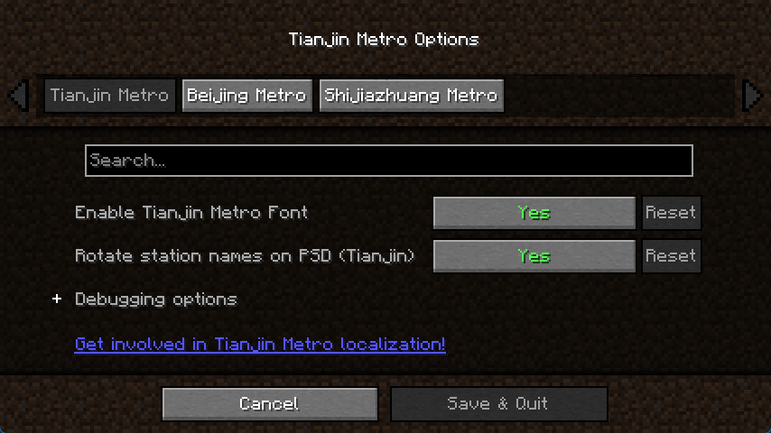

# Central Config



Central Config is a [header-only-like](https://en.wikipedia.org/wiki/Header-only) centralized configuration management library for [Cloth Config](https://github.com/shedaniel/cloth-config). Allowing the parent mod and child mods using a single config screen, and registering a config category for configs respectively.

This concept is called "Central Config". The parent mod creates a unified configuration interface so that child mods can register their own configs on a single config screen.

## 🧠 Why this library was developed

Generally, our mods don't have too many configs to need [config categories](https://shedaniel.gitbook.io/cloth-config/using-cloth-config/creating-a-config-category). Therefore, in many mods, categories aren't being used.

When a parent mod has many child mods, and all these mods have their configs (usually few), finding their config screen entry or switching between config screens is very complicated.

Central Config takes advantage of categories, reorganizes config screens to categories. In this way, the parent mod and child mods can put their configs into a single screen. This makes switching easier, and gives mod configs more chances to be shown to players.

## 📚 Overview

Central Config is a lightweight library. There are three classes only:

- [CentralConfig](src/main/java/ziyue/centralconfig/CentralConfig.java): The configuration manager owned by the parent mod. It is responsible for building the config screen, and collecting configs of child mods.
- [MasterCategory](src/main/java/ziyue/centralconfig/MasterCategory.java): The configuration category belonging to the parent mod, always displayed first.
- [ModuleCategory](src/main/java/ziyue/centralconfig/ModuleCategory.java): A configuration category for child mods that can be registered to the manager.

MasterCategory and ModuleCategory are bound with a **unique mod ID**, it is the unique key of the category.

Technically, MasterCategory and ModuleCategory are reusable, meaning that there can be multiple parent mods at the same time.

## 📥 Install

> [!IMPORTANT]
> Only the parent mod needs to install it. After installing, it will become a part of the mod.

Like header-only libraries in C/C++, you need to copy and paste [the source code of Central Config](src/main/java) to your project. At the same time, you may need to modify the code (for example, `Text` to `Component`) to fit your mod loader and Minecraft version.


## 🧩 Usage

### 1. Create the Master Category

You need to create a [MasterCategory](src/main/java/ziyue/centralconfig/MasterCategory.java) instance for the parent mod, which contains configs of the mod, and the base settings of the config screen.

```java
MasterCategory masterCategory = new MasterCategory(
    "mymodid",
    () -> Text.literal("Main Settings"),
    (entryBuilder, category) -> {
        category.addEntry(entryBuilder.startBooleanToggle(Text.literal("Enable Feature"), true)
            .setDefaultValue(true)
            .setSaveConsumer(newValue -> {/* Save logic here */})
            .build());
    },
    () -> ConfigBuilder.create().setTitle("Config Screen")
);
```

### 2. Initialize CentralConfig

Create a `CentralConfig` instance and pass in the `masterCategory`.

```java
CentralConfig centralConfig = new CentralConfig(masterCategory);
```


### 3. Register Child Mod Categories

Child mods can create their own `ModuleCategory` instances and register them via `centralConfig.registerModuleCategory()`.

```java
ModuleCategory subCategory = new ModuleCategory(
    "submodid",
    () -> Text.literal("Sub Settings"),
    (entryBuilder, category) -> {
        category.addEntry(entryBuilder.startIntSlider(Text.literal("Max Value"), 0, 100)
            .setDefaultValue(50)
            .setSaveConsumer(value -> {/* Save logic here */})
            .build());
    }
);

centralConfig.registerModuleCategory(subCategory);
```

### 4. Get the config screen

You can get the config screen like this:

```java
Screen configScreen = centralConfig.getConfigScreen(parent, moduleCategory);
// Or specify with mod ID
// Screen configScreen = centralConfig.getConfigScreen("submodid");
```

This will get the config screen and opens `moduleCategory` by default.
